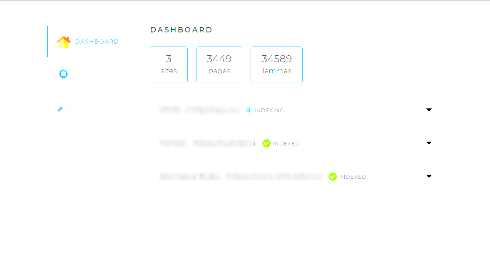
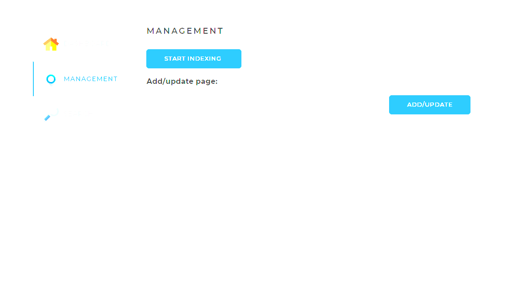
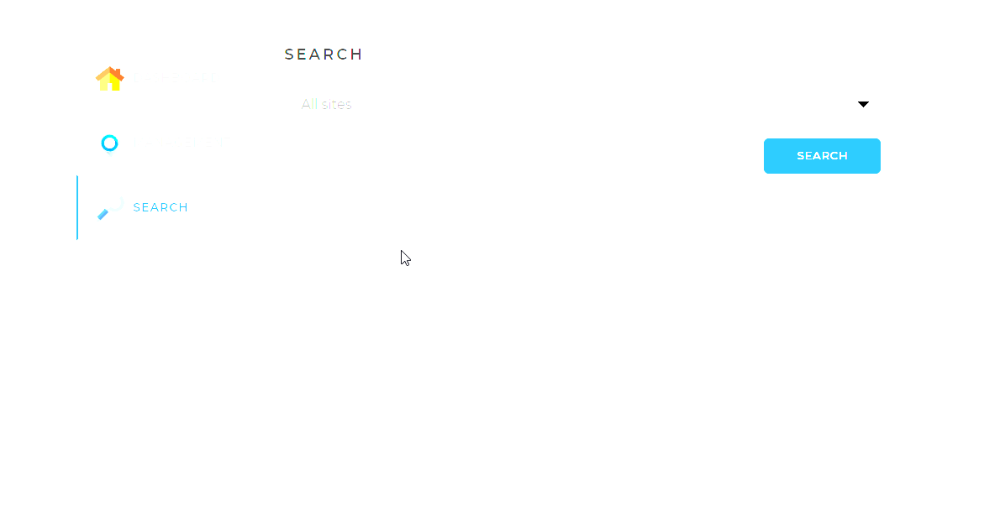

<body>
    <header>
        

            <h1>Поисковой движок "Helion"</h1>
            <h2><b>"Helion"</b> - search engine</h2>
            

                
            

            
 <h3><b>"Helion"</b> - Web-приложение позволяющее производить поиск информации по сайтам.</h3>  

        

    </header>
    <main>
        

            <h2>Что делает "движок"?</h2>
            

                <li>Производит индексацию сайтов, заданных в конфигурационным файле;</li>
                <li>По итогам индексации сайта осуществляет предоставление информации по поисковым запросам пользователей;</li>
                <li>Предоставляет информацию о статусе индексации, с количеством проиндексированных сайтов и странниц на нем, и количестве лемм на сайте;</li> 
                <li>Позволяет произвести переиндексацию сайта в целом, а так же отдельных страниц сайта;</li>
                <li>Позволяет остановить запущенную индексацию;</li>
                <li>Позволяет производить поиск по выбранному сайту</li>
            

            <h2>Интерфейс приложения</h2>
            

                

                    
                

                <h3>Стартовая страница приложения и информациооное меню по статусу индексации сайтов</h3>
                

                    
                

                <h3>Меню запуска индексации и переиндексации сайтов/страниц</h3>
                

                    
                

                <h3>Поисковое меню приложения</h3>
            

            <h2>Для работы приложения потребуется</h2>
            

                <li>База данных MySQL/PostgreSQL</li>
                <li>Настроить конфигурационный файл для подключения БД</li>
            

        

    </main>
</body>
